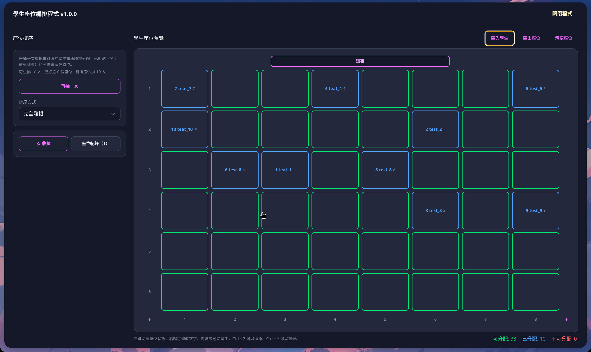

# SeatApp — 學生座位編排程式

An Electron desktop app for teachers: build a classroom seat grid, import a student roster from
XLSX, arrange seats randomly or by rule, fine-tune by hand, and export to XLSX / PDF / PNG.
The application UI is entirely in Traditional Chinese.

**[English](#english) ｜ [繁體中文](#繁體中文)**



---

## English

### Part 1 — For Users

#### What it is

SeatApp turns a classroom seating chart into a five-minute job. You draw the grid, import the class
roster from an Excel file, pick how students should be distributed — fully random, spread across
categories, exam spacing, or ordered by a numeric value — then export the result as a spreadsheet,
a printable PDF, or an image.

Everything runs locally. No account, no network, no data leaves the machine.

#### Installation

The distributed build is a **Windows portable executable** — no installer, just run it. Build it
yourself with `npm run dist`; the output lands in `dist/`.

macOS and Linux are not published as releases, but `npm run make` produces a ZIP (macOS) or `.deb`
(Linux) bundle from source. See Part 2 for the toolchain requirements.

#### Interface tour

| Area                   | What it holds                                                                                                                                     |
| ---------------------- | ------------------------------------------------------------------------------------------------------------------------------------------------- |
| Left panel（座位排序） | Re-draw button, arrangement mode and its options, favourites and saved layouts                                                                    |
| Centre                 | The seat grid, with a 講臺 (podium) bar, row numbers at the left, column numbers below, and `+` handles at the bottom corners to add rows/columns |
| Top right              | 匯入學生 (import), 匯出座位 (export), 清空座位 (clear)                                                                                            |
| Bottom right           | Live counters — assignable / assigned / disabled seats                                                                                            |

#### How to use it

**1. Shape the grid.** Left-click a seat to toggle it between assignable and disabled; use the `+`
handles to add or remove rows and columns. The grid starts at 6 × 8 and goes up to **29 rows × 11
columns**.

**2. Import the roster.**


Pick an `.xlsx` file (or drag one in) and the preview dialog opens:

- **顯示欄位 (seat label)** — `合併整列` joins every cell of the row with a separator, or
  `組合指定欄位` combines specific columns. Column numbers are 1-based: Excel's column A is `1`.
- **排序依據 (sort key)** — the value used later for categorising or ordering. Choose `不記憶`
  (none), `依名單順序` (number the rows 1, 2, 3… top-down), or `指定欄位` (read one column, e.g.
  a score, group, or gender column).
- **略過第一列** — skip the header row.
- **檔案預覽** — the first three rows are previewed; clicking a column header selects it as a seat
  label column directly.

Rows with a blank name are dropped. Importing more students than there are assignable seats is
blocked, so add seats first.

**3. Choose an arrangement.**


| Mode           | What it does                                                                                                                                                |
| -------------- | ----------------------------------------------------------------------------------------------------------------------------------------------------------- |
| 完全隨機       | Fully random reshuffle                                                                                                                                      |
| 依類別交錯     | Spreads neighbouring seats across different sort-key categories, leaving no gaps                                                                            |
| 考試座         | Opens up exam spacing first — `隔一欄留空` (skip every other column) or `棋盤式坐法` (checkerboard) — then fills what remains; unused seats become disabled |
| 依數值大小填入 | Fills seats in numeric order of the sort key                                                                                                                |

依數值大小填入 combines an order — `升冪` (ascending), `降冪` (descending), or `平均分配` (each
group balanced high/low) — with a fill pattern: `橫向填入` (row by row), `S 型填入`, `直向填入`
(column by column), or `2×2 區塊`. **群內隨機排序** shuffles students inside each group while the
groups themselves stay in numeric order.

Every mode except 考試座 needs sort-key data, so choose a 排序依據 at import time if you plan to use
one. Pinned seats never move.

**4. Export.**


XLSX, PDF, or PNG. PDF and PNG take an export title, an optional 講臺 header, and optional row/column
numbers; page orientation follows the grid's aspect ratio.

#### Other operations

- **Right-click a seat** to edit its label, pin it, or remove the student.
- **Ctrl + Z / Ctrl + Y** — undo and redo, up to 50 steps.
- **☆ 收藏** saves the current layout under a name (up to 30 kept); the most recent one is restored
  automatically the next time the app opens.

#### Roster file format

A minimal roster is one column of seat numbers and one of names:

|     | A (seat no.) | B (name) |
| --- | ------------ | -------- |
| 1   | 1            | 王小明   |
| 2   | 2            | 陳小美   |
| 3   | 3            | 李小華   |

Add more columns freely — a score, class, or group column makes a good 排序依據 for the categorised
and numeric arrangements.

#### FAQ

- **Where is my data stored?** Favourites and import settings live in the app's local storage on
  that machine only. They do not sync and do not travel with the exported files.
- **What happens to seats I already set up when I import?** Seats that stay unassigned are reset to
  assignable, but seats you disabled stay disabled.

### Part 2 — For Developers

#### Stack

Electron Forge + Vite, React 19, TypeScript, Tailwind CSS v4, Headless UI. `xlsx`, `jspdf`, and
`file-saver` are dynamically `import()`ed at call time to keep them out of the initial renderer
bundle — preserve that pattern.

#### Requirements

- Node.js **≥ 22.12.0** (`engines` in `package.json`)
- npm

#### Commands

```bash
npm ci               # install the locked dependency set
npm start            # electron-forge start — Vite dev server with HMR
npm run lint         # eslint .
npm run format       # prettier --write .
npm run format:check # prettier --check .
npm run package      # unpacked application bundle
npm run make         # Squirrel (win) / ZIP (darwin) / deb distributables
npm run dist         # electron-builder Windows portable → dist/
```

There is **no test framework and no typecheck script** (`tsc` is `noEmit` and only drives the editor
and Vite). Every change must pass `npm run lint` and `npm run format:check`, plus a manual smoke test
under `npm start`.

Formatting is Prettier's job: four-space indent, double quotes, semicolons, trailing commas,
100-column width. Never hand-format — run `npm run format`.

#### Project layout

```
src/
  main.ts               Electron main process — creates a frameless BrowserWindow
  preload.ts            empty stub
  renderer.ts           renderer entry
  app.tsx               createRoot(document.body)
  index.tsx             title bar + version from package.json
  index.css             Tailwind v4 + @layer components (.basicSeat, .functionalButton, …)
  Compontent/
    SeatTable.tsx       seat state, undo/redo, import/export, favourites, all dialogs
    seatModel.ts        Seat types, createSeat, shuffle
    seatArrange.ts      the arrangement algorithms
    seatExport.ts       canvas → PNG / PDF
    seatBar.tsx         status counters
docs/assets/            README screenshots and other doc images
```

#### Architecture notes

- **There is no IPC.** The main process only opens the window; file reading, XLSX parsing, canvas
  rendering, and saving all happen in the renderer with browser APIs. Adding a feature does not
  normally require touching `src/main.ts`.
- The window frame is drawn by the app — dragging comes from `-webkit-app-region: drag` on
  `.titleBar`, and the close button calls `window.close()`.
- `seatList` is a **flat array indexed `row * colCount + col`**. Every row/column operation reindexes
  by hand, so an off-by-one silently scrambles the grid.
- All seat mutations must go through `applySeatLayout`, which pushes an undo snapshot before applying
  the change. `replaceSeatLayout` is the raw setter, used only by undo/redo.
- Always construct seats via `createSeat` — status, name, pin, and tag are not independent fields.
- The directory misspelling `Compontent` is intentional-by-inertia; keep it unless a rename updates
  every import.

#### Contributing

New user-facing strings must be in Traditional Chinese.

#### License

MIT.

---

## 繁體中文

### 第一章 給使用者

#### 這是什麼

SeatApp 把排座位變成五分鐘就能完成的事。你先畫出座位表，從 Excel 匯入班級名單，選一種分配方式
——完全隨機、依類別交錯、考試座、或依數值大小填入——再把結果匯出成試算表、可列印的 PDF 或圖片。

所有運算都在本機完成，不需要帳號、不需要連網，資料不會離開你的電腦。

#### 安裝

正式散布的版本是 **Windows 免安裝執行檔（portable）**，下載後直接執行即可。自行建置請用
`npm run dist`，產物會放在 `dist/`。

macOS 與 Linux 沒有發行版本，但可以從原始碼用 `npm run make` 產生 ZIP（macOS）或 `.deb`（Linux）。
建置環境需求見第二章。

#### 介面導覽

| 區域             | 內容                                                                    |
| ---------------- | ----------------------------------------------------------------------- |
| 左側「座位排序」 | 再抽一次／套用排序按鈕、排序方式與其選項、收藏與座位紀錄                |
| 中央             | 座位表本體，含講臺列、左側列號、下方欄號，左右下角的 `+` 可以增減列與欄 |
| 右上             | 匯入學生、匯出座位、清空座位                                            |
| 右下             | 即時計數：可分配／已分配／不可分配                                      |

#### 使用流程

**1. 調整座位表。** 左鍵點座位可在「可分配」與「停用」之間切換，用 `+` 增減列與欄。預設 6 × 8，
上限為 **29 列 × 11 欄**。

**2. 匯入學生名單。**


選擇（或拖入）`.xlsx` 檔案後會開啟預覽視窗：

- **顯示欄位** — `合併整列` 會把整列的每一格用分隔字元串起來；`組合指定欄位` 則只組合你指定的欄位。
  欄位編號從 1 開始，Excel 的 A 欄就是第 1 欄。
- **排序依據** — 之後分類或排大小要用的值。可選 `不記憶`、`依名單順序`（由上往下編號 1、2、3…，
  適合座號或已排好序的名單）或 `指定欄位`（記住某一欄的值，例如成績、組別、性別）。
- **略過第一列** — 名單第一列是欄位標題時勾選。
- **檔案預覽** — 顯示前三列；點欄位標題就等於把該欄選為顯示欄位。

姓名空白的列會被過濾掉。學生人數超過可分配座位時會被擋下，請先增加座位。

**3. 選擇排序方式。**


| 排序方式       | 效果                                                                                                 |
| -------------- | ---------------------------------------------------------------------------------------------------- |
| 完全隨機       | 未釘選的學生整批重新隨機分配                                                                         |
| 依類別交錯     | 依排序依據分類，讓相鄰座位盡量落在不同類別，座位之間不留空白                                         |
| 考試座         | 先依座位圖樣留出空位（`隔一欄留空` 或 `棋盤式坐法`）再把學生填進剩下的座位；沒被選到的座位會改為停用 |
| 依數值大小填入 | 依排序依據的數值大小依序排入座位；沒有數值的學生排在最後                                             |

依數值大小填入需要再選數值順序——`升冪（小 → 大）`、`降冪（大 → 小）`、`平均分配（每群高低平均）`
——以及填入方式：`橫向填入`（一列為一群）、`S 型填入`、`直向填入`（一排為一群）、`2×2 區塊`。
勾選 **群內隨機排序** 會把同一群內的順序打亂，群與群之間仍照數值大小。

除了考試座以外，每一種排序方式都需要排序依據資料，所以匯入時就要先指定好。已釘選的座位永遠不會被
重新排列。

**4. 匯出。**


可選 XLSX、PDF、PNG。PDF 與 PNG 可以填匯出標題、選擇是否列印講臺、是否顯示列欄編號；頁面方向會依
座位表的長寬比自動決定。

#### 其他操作

- **在座位上按右鍵** 可以修改座位文字、釘選座位或刪除學生。
- **Ctrl + Z／Ctrl + Y** — 復原與重做，最多 50 步。
- **☆ 收藏** 會把目前的座位配置以名稱存起來（最多 30 筆），下次開啟程式時自動還原最近的一筆。

#### 名單檔案格式

最精簡的名單就是一欄座號加一欄姓名：

|     | A（座號） | B（姓名） |
| --- | --------- | --------- |
| 1   | 1         | 王小明    |
| 2   | 2         | 陳小美    |
| 3   | 3         | 李小華    |

也可以多放幾欄——成績、班級、組別之類的欄位很適合當作排序依據，供依類別交錯與依數值大小填入使用。

#### 常見問題

- **資料存在哪裡？** 收藏的座位配置與匯入設定只存在這台電腦的本機儲存空間，不會同步、換電腦不會跟著走，也不會夾帶在匯出的檔案裡。
- **匯入會不會蓋掉我排好的座位？** 沒有被指派到學生的座位會重設為可分配，但你手動停用的座位仍然
  維持停用。

### 第二章 給開發者

#### 技術堆疊

Electron Forge + Vite、React 19、TypeScript、Tailwind CSS v4、Headless UI。`xlsx`、`jspdf`、
`file-saver` 都是在呼叫當下才動態 `import()`，藉此避免進入初始的 renderer bundle。

#### 環境需求

- Node.js **≥ 22.12.0**（`package.json` 的 `engines`）
- npm

#### 指令

```bash
npm ci               # 依 lock 檔安裝相依套件
npm start            # electron-forge start — Vite 開發伺服器與 HMR
npm run lint         # eslint .
npm run format       # prettier --write .
npm run format:check # prettier --check .
npm run package      # 未壓縮的應用程式包
npm run make         # Squirrel（win）／ZIP（darwin）／deb 散布檔
npm run dist         # electron-builder Windows portable → dist/
```

本專案**沒有測試框架，也沒有 typecheck 指令**（`tsc` 是 `noEmit`，只服務編輯器與 Vite）。每次修改都
必須通過 `npm run lint` 與 `npm run format:check`，並用 `npm start` 做一次手動煙霧測試。

排版交給 Prettier：四格縮排、雙引號、分號、結尾逗號、100 欄寬。不要手動排版，請執行
`npm run format`。

#### 專案結構

```
src/
  main.ts               Electron 主行程——建立無邊框 BrowserWindow
  preload.ts            空的 stub
  renderer.ts           renderer 進入點
  app.tsx               createRoot(document.body)
  index.tsx             標題列，版本號取自 package.json
  index.css             Tailwind v4 與 @layer components（.basicSeat、.functionalButton…）
  Compontent/
    SeatTable.tsx       座位狀態、undo/redo、匯入匯出、收藏與所有對話框
    seatModel.ts        Seat 型別、createSeat、shuffle
    seatArrange.ts      座位排列演算法
    seatExport.ts       canvas → PNG／PDF
    seatBar.tsx         狀態計數列
docs/assets/            README 截圖與其他文件用圖片
```

#### 架構要點

- **完全沒有 IPC。** 主行程只負責開視窗；讀檔、解析 XLSX、canvas 繪製、存檔全都在 renderer 用瀏覽器
  API 完成。新增功能通常不需要動 `src/main.ts`。
- 視窗外框是自己畫的——拖曳來自 `.titleBar` 上的 `-webkit-app-region: drag`，關閉按鈕呼叫
  `window.close()`。
- `seatList` 是 **以 `row * colCount + col` 索引的一維陣列**。每個列／欄操作都是手動重新編索引，
  一個 off-by-one 就會悄悄打亂整張座位表。
- 所有座位變更都必須經過 `applySeatLayout`，它會先推入 undo 快照再套用變更。`replaceSeatLayout`
  是原始 setter，只給 undo/redo 自己用。
- 建立座位一律透過 `createSeat`——狀態、名稱、釘選與 tag 之間互相牽動，不是獨立欄位。
- 資料夾拼字 `Compontent` 是刻意保留的，除非有一次改動能更新所有 import，否則不要改。

#### 貢獻

新增的使用者介面文字一律使用繁體中文。

#### 授權

MIT。
